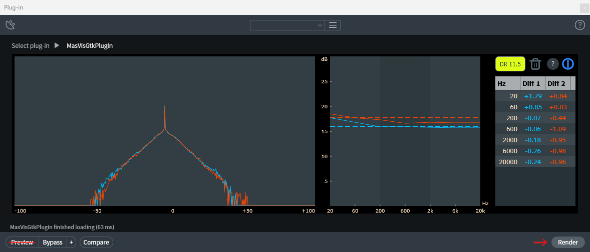

# MasVisGtk Plugin

MasVisGtk is available as a plugin for digital audio workstations (DAWs).



The plugin is a non-real-time (offline) rendering plugin written in `C++`, with the JUCE framework, unlike MasVisGtk, which is in written in `python`, using `numpy`, `matplotlib`, and `scipy`. MasVisGtkPlugin is under the same license (GPL2) as MasVisGtk. It makes a histogram and an allpass crest factor plot. The table shows how much loudness in [dB] may have been added to the audio file, to make it more compressed.

## Usage

An non-real-time (offline) rendering capable application (DAW) is required.

Copy the MasVisGtkPlugin.vst3 file from repository to the `C:\Program Files\Common Files\VST3` folder, in your Windows (x64).

Restart your DAW, or refresh your plugins.

Open an audio file and render it, to see the analysis plots.

Previews, compare, bypass functionalities are not supported.

## Known Issues

If there is any discrepancy in the results, the python version results is correct.

The plugin can be compiled for Linux, but is not expected to run correctly (Xorg/Wayland issues).

## Compiling from source

Source code was made with the JUCE framework. Depending on you platform, you can use `Visual Studio` for Windows, `Xcode` for MacOS, and `make` for Linux.

### On Windows

1. Install Visual Studio

	Visual Studio is an IDE for C/C++, and requires 8 to 12 GB

	MinGW is not allowed for JUCE framework compilation

2. Download JUCE framework and extract

3. Create or open/update JUCE project file `.jucer` with Projucer binary application
    1. Check that all the paths to JUCE are correct
    2. Add a 'Visual Studio' exporter
    3. Check type is 'audio plugin', not 'application', in settings

4. Save Project, close JUCE

	This creates a folder `MasVisGtkPlugin\Builds\VisualStudio2022`

5. Open the .sln file in Visual Studio and build it

6. Go to folder

`MasVisGtkPlugin\Builds\VisualStudio2022\x64\Debug\VST3\MasVisGtkPlugin.vst3\Contents\x86_64-win`

7. Copy binary `MasVisGtkPlugin.vst3` to folder

`C:\Program Files\Common Files\VST3\`

### On Linux

1. Install packages, [ see the latest JUCE deps](github.com/juce-framework/JUCE/blob/master/docs/Linux%20Dependencies.md)

```
sudo apt install build-essential cmake git
sudo apt install libasound2-dev libjack-jackd2-dev \
    ladspa-sdk \
    libcurl4-openssl-dev  \
    libfreetype-dev libfontconfig1-dev \
    libx11-dev libxcomposite-dev libxcursor-dev libxext-dev \
    libxinerama-dev libxrandr-dev libxrender-dev \
    libwebkit2gtk-4.1-dev \
    libglu1-mesa-dev mesa-common-dev
```

2. Download JUCE framework and extract

3. Create or open/update JUCE project file `.jucer` with Projucer binary application
    1. Check that all the paths to JUCE are correct
	2. Add a 'Linux Makefile' exporter
	3. Check type is 'audio plugin', not 'application', in settings

4. Save project, close JUCE application

5. Go to project folder, in terminal
  
	`cd NameOfProject/Builds/LinuxMakefile`

6. Build code with make:

	`make CONFIG=Debug` or `make CONFIG=Release`

7. Go to `LinuxMakefile/build` folder

	expect a folder `MasVisGtkPlugin.vst3`

8. Copy the folder to a location, where your DAW can scan and use it


### Debugging

There is a `log_file` object in the source code, to help with debugging in a regular DAW.

1. Uncomment the `log_file` lines
    1. `std::ofstream log_file;`
    2. `log_file.open("C:\\Users\\yourusername\\masvisgtk_log.txt", std::ios::out | std::ios::app | std::ios::binary);`
    3. `log_file << "some test" << std::endl;`
2. Change the path to a location of your choosing (that you can write to)
3. Compile the vst3 file
4. Copy vst3 file (Windows) or folder (Linux) to plugin location
5. Run DAW with plugin
6. Generate rendering
7. Read masvisgtk_log.txt
