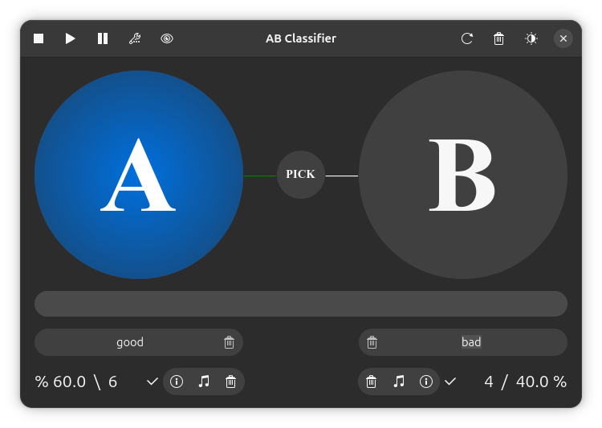
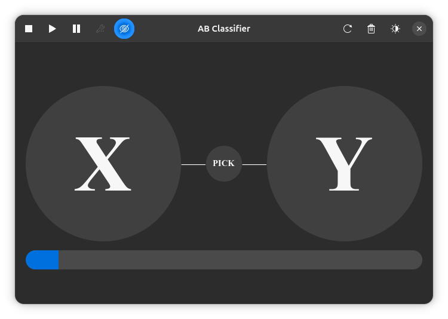

# Extras

Extras branch contains utilities, that cannot easily be included inside MasVisGtk.

## AB Classifier

### Description

**AB Classifier** compares two audio files, by matching their levels with True Peaks, which removes the subjective factor of 'louder is better'.

Users can switch between the two tracks, picking whichever is preferred. In **BLIND MODE**, the tracks are hidden and switched on random, by clicking the selection buttons **A** or **B**.

The application is written in **python**, requires locally installed **GStreamer** and **FFMPEG** utilities.

AB Classifier is under GPL2 license.

### Usage

`python ab_classifier.py`

or

`python ab_classifier.py --theme dark`

