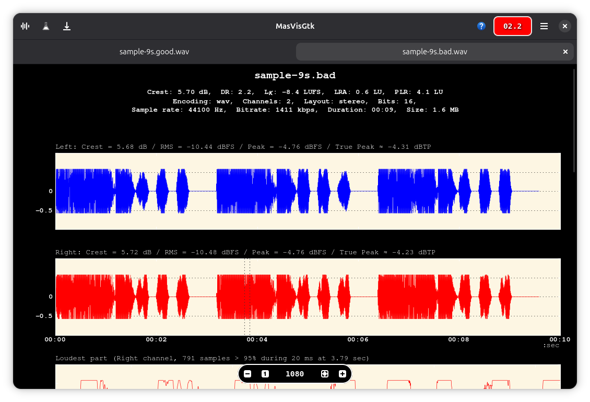

# MasVisGtk

<div align="center">
  
  
  **Audio loudness analysis tool for your music library, made for the GNOME desktop**
  
  
  
  
</div>

---

## 🎵 Overview

**MasVisGtk** is a comprehensive audio analysis tool designed to help you detect mastering defects and improve your music library quality. Built specifically for the GNOME desktop environment, it provides detailed insights into your audio files' technical characteristics.

**Key Features:**
- Detect audio mastering defects
- Analyze your entire music library
- Save detailed analysis reports
- Professional-grade audio metrics

---

## ✨ Features

### 📊 **Analysis Capabilities**
- **Waveform Plotting** - Visual representation of audio signals
- **Frequency Analysis** - Detailed frequency spectrum plots  
- **Dynamic Range (DR) Estimation** - Measure audio dynamics
- **Peak Estimation** - Identify signal peaks
- **Crest Factor Analysis** - Signal quality metrics
- **Histogram Visualization** - Statistical audio data
- **Peak vs RMS Analysis** - Loudness relationship plots
- **EBU R128 Loudness Standards** - Professional broadcast standards
- **Multi-channel Audio Support** - Stereo and surround sound

### 🗂️ **File Management**
- **Folder Overview** - Batch analysis with folder support
- **Recursive Processing** - Analyze entire directory trees
- **Multiple Format Support** - Wide range of audio formats

---

## 🎧 Supported Audio Formats

| Format | Extension | Description |
|--------|-----------|-------------|
| **WAV** | `.wav` | Uncompressed audio |
| **FLAC** | `.flac` | Lossless compression |
| **MP3** | `.mp3` | MPEG audio |
| **M4A** | `.m4a` | Apple audio |
| **OGG** | `.ogg` | Ogg Vorbis |
| **Opus** | `.opus` | Modern codec |
| **AAC** | `.aac` | Advanced audio coding |
| **AC3** | `.ac3` | Dolby Digital |
| **AIFF** | `.aiff` | Apple audio format |
| **AMR** | `.amr` | Adaptive multi-rate |
| **ALAC** | `.alac` | Apple lossless |
| **PCM** | `.pcm` | Raw audio data |
| **WMA** | `.wma` | Windows media audio |

---

## 💾 Export Formats

Save your analysis in multiple professional formats:

```
📊 PNG  - Portable Network Graphics
📄 EPS  - Encapsulated PostScript  
🖼️ JPEG - Joint Photographic Experts Group
📋 PDF  - Portable Document Format
🎨 SVG  - Scalable Vector Graphics
🖥️ TIFF - Tagged Image File Format
🌐 WebP - Modern web format
```

---

## 🖥️ System Requirements

### **Minimum Specifications**
- **CPU:** 2 physical cores, 4 threads
- **RAM:** 8 GB minimum
- **Storage:** ~200 MB for Flatpak installation
- **Dependencies:** FFMPEG and FFPROBE (locally installed)

### **Recommended for Large Files**
- **RAM:** 16 GB or more for files ≥20 minutes
- **CPU:** Multi-core processor for faster processing

---

## 📦 Installation

### **Option 1: Flathub (Recommended)**
```bash
flatpak install flathub io.github.itprojects.MasVisGtk
```

### **Option 2: Build from Source**
1. **Clone the repository**
   ```bash
   git clone [repository-url]
   ```

2. **Open with GNOME Builder**
   - Import the project in GNOME Builder  
   - Build the project ⚠️ *First build takes significant time*

3. **Export Flatpak**
   - Use the Export option from the dropdown menu
   - Locate the built Flatpak at:
   ```
   ~/.var/app/org.gnome.Builder/cache/gnome-builder/projects/MasVisGtk/flatpak/staging/x86_64-main/io.github.itprojects.MasVisGtk.flatpak
   ```

4. **Install locally**
   ```bash
   flatpak install io.github.itprojects.MasVisGtk.flatpak
   ```

---

## 🚀 Usage

### **Launch Application**
```bash
# Start the GUI application
flatpak run io.github.itprojects.MasVisGtk
```

### **Command Line Options**

#### **Basic Usage**
```bash
# Open single file
flatpak run io.github.itprojects.MasVisGtk /path/to/audio.wav

# Open multiple files
flatpak run io.github.itprojects.MasVisGtk /path/to/file1.wav '/path/to/file 2.mp3'

# Open files and folders
flatpak run io.github.itprojects.MasVisGtk /path/to/file.mp3 '/path/to/music/folder'
```

#### **Advanced Options**
```bash
# Recursive folder processing
flatpak run io.github.itprojects.MasVisGtk -r /path/to/music/library

# Overview mode with flat structure
flatpak run io.github.itprojects.MasVisGtk -r -o flat /path/to/music

# Show help
flatpak run io.github.itprojects.MasVisGtk --help
```

#### **Command Line Flags**
| Flag | Description |
|------|-------------|
| `-v, --version` | Show version information |
| `-b, --verbose` | Enable verbose messages |
| `-d, --debug` | Enable debug messages |
| `-f, --formats` | Show supported FFMPEG formats |
| `-l, --LU` | Use LU instead of LUFS for R128 values |
| `-o, --overview-mode` | Set overview mode: `flat` or `dir` |
| `-r, --recursive` | Process subfolders recursively |

---

## 🔬 Advanced Usage: PyMasVis Module

The original `pymasvis` Python module is bundled for command-line analysis:

### **Detailed Analysis**
```bash
# Single file analysis
flatpak run io.github.itprojects.MasVisGtk --pymasvis --destdir /output/path /path/to/audio.wav

# Batch folder analysis
flatpak run io.github.itprojects.MasVisGtk --pymasvis -r --destdir /output/path '/path/to/folder'
```

### **Overview Generation**
```bash
# File overview
flatpak run io.github.itprojects.MasVisGtk --pymasvis --overview --destdir /output/path /path/to/file.wav

# Folder overview (flat mode)
flatpak run io.github.itprojects.MasVisGtk --pymasvis --overview --overview-mode flat --destdir /output/path '/path/to/folder'
```

---

## 📈 Understanding Dynamic Range

### **Dynamic Range Quality Chart**

| DR Value | Quality Level | Description |
|----------|---------------|-------------|
| **DR1-6** | 🔴 **Poor** | Heavily compressed, "brick-walled" |
| **DR7-10** | 🟡 **Fair** | Moderately compressed |
| **DR11-14** | 🟢 **Good** | Well-balanced dynamics |
| **DR15+** | 🟢 **Excellent** | Natural, uncompressed dynamics |

> **Note:** Higher DR values generally indicate better audio quality with more natural dynamics.

---

## 🎨 Screenshots

<details>
<summary>📸 View Application Screenshots</summary>


*Light theme interface showing detailed audio analysis*


*Dark theme with comprehensive analysis plots*


*Advanced configuration options*


*Batch overview of multiple audio files*


*Application preferences and settings*


*Audio comparison dialog interface*

</details>

---

## ⚠️ Known Issues & Limitations

### **System Compatibility**
- Designed for UTF-8 systems
- Minimum audio duration: **3 seconds** (shorter files may cause crashes)
- `DR: ??` indicates insufficient samples for analysis

### **Performance Considerations**
- **RAM Usage:** Application is memory-intensive
- **File Limits:** 
  - Do not open >10 files simultaneously on systems with <8GB RAM
  - Avoid files ≥20 minutes unless you have ≥16GB RAM
  - Large files (≥100MB each) require significant memory

### **Export Limitations**
- PostScript, PGF LaTeX, and Raw RGBA bitmap exports only available through matplotlib toolbar
- Video file support is experimental (enable in preferences)

---

## 🌐 Useful Resources

### **External Tools & References**
- 🎵 **[Loudness War Database](https://dr.loudness-war.info/)** - Compare your music's loudness metrics
- 📚 **[EBU R128 Guidelines](https://tech.ebu.ch/publications/tech3343)** - Professional loudness standards
- 🔧 **[Original PyMasVis](https://github.com/joakimfors/PyMasVis)** - Source project by Joakim Fors
- 🎓 **[MasVis Collaboration](https://www.lts.a.se/ljudteknik/masvis)** - Academic research background

---

## 📋 Technical Details

### **Core Dependencies**
- **Python Libraries:** `numpy`, `scipy`, `matplotlib`
- **Audio Processing:** FFMPEG/FFPROBE
- **GUI Framework:** GTK for GNOME
- **Packaging:** Flatpak with bundled dependencies

### **Source Code**
- **Size:** <1 MB source code
- **Flatpak Size:** >200 MB (includes `openblas`, `lapack`, `numpy`, `scipy`, `pyplot`)

---

## 📄 License

**MasVisGtk** is released under the **GNU General Public License v2.0 or later**.

You are free to use, modify, and distribute this software under the terms of the GPL.

---

<div align="center">
  
**Made with ❤️ for the GNOME desktop**

*Improve your music library quality with professional audio analysis*

</div>
