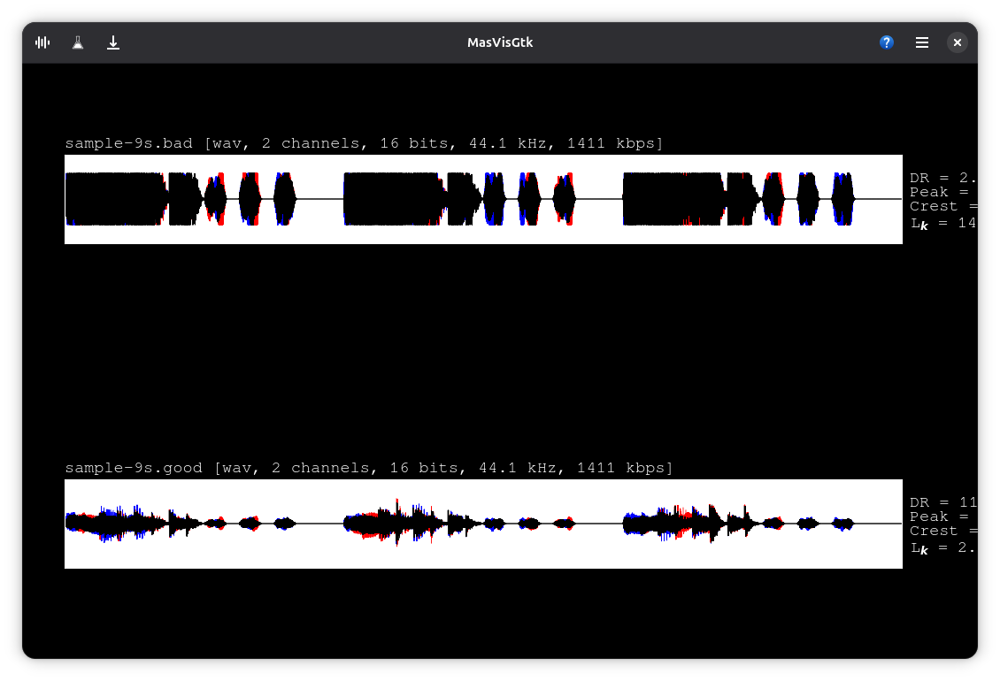
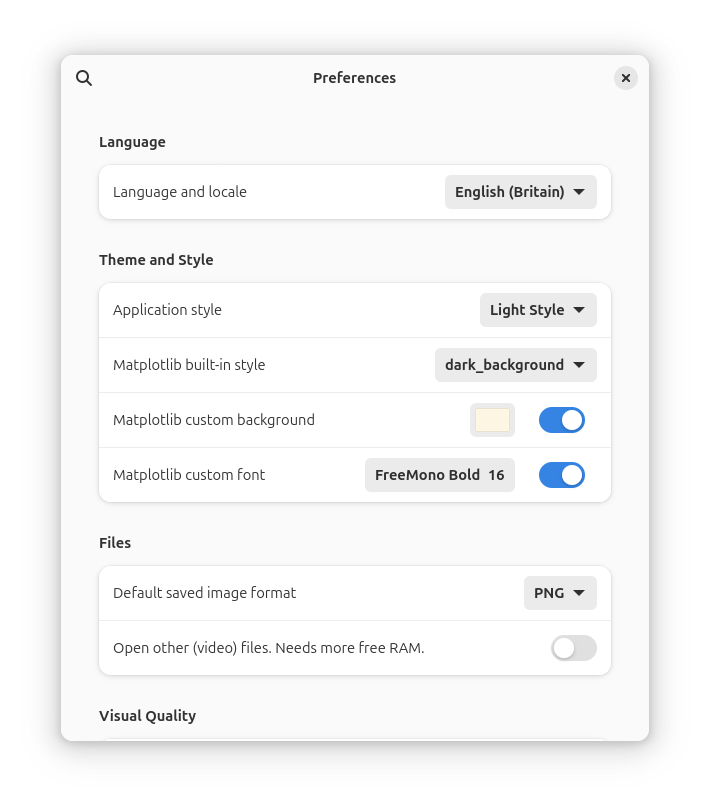

MasVisGtk
=========

Audio loudness analysis tool for your music library, made for the GNOME desktop.

Detect audio mastering defects, improve your music/library.

Open a file, make analysis, save file (if you want to).

Based on `pymasvis` python app/module, using `numpy`, `scipy`, `pyplot` (`matplotlib`).

* Waveform plotting
* Overview of files (*by-folder* support)
* **Frequency** plot
* Dynamic Range (**DR**) estimation
* **Peak** estimation
* **Crest Factor** estimation
* **Histogram** plot
* **Peak** vs. RMS plot
* **Loudness** analysis, **EBU R128** plot
* Multi-channel audio support

Local installation of **FFMPEG and FFPROBE is required**.

Supported formats **WAV**, **FLAC**, **MP3**, **M4A**, **OGG**, **OPUS**, **AAC**, **AC3**, **AIFF**, **AMR**, **ALAC**, **PCM**, **WMA**.

You can save the analysis in the following formats:
```
PNG  | Portable Network Graphics
EPS  | Encapsultaed Postscript
JPEG | Joint Photographic Experts Group
PDF  | Portable Document Format
SVG  | Scalable Vector Graphics
TIFF | Tagged Image File Format
WebP | WebP Image Format
```






Flatpaks
--------

Flatpak from [flathub](https://flathub.org/apps/io.github.itprojects.MasVisGtk), or to build, see instructions below.


Build flatpak
-------------

1. Pull git repository
2. Open with Gnome-Builder, build

   **The first build is very long!** After that *it's quick*.

4. In Gnome-Builder Export, from the drop-down menu (near run button).
5. Find flatpak

`~/.var/app/org.gnome.Builder/cache/gnome-builder/projects/MasVisGtk/flatpak/staging/x86_64-main/io.github.itprojects.MasVisGtk.flatpak`

5. flatpak install io.github.itprojects.MasVisGtk.flatpak
6. flatpak run io.github.itprojects.MasVisGtk, or use the shortcut

The source code is less than **1 MB**. HOWEVER, *the flatpak file is large* (>200 MB), because `openblas`, `lapack`, `numpy`, `scipy` and `pyplot` are included.

Usage
-----

Click on **desktop shortcut**, or run from *terminal*.

The original `pymasvis` is bundled within the app, in order to save analysis files directly from terminal.

MasVisGtk and pymasvis have different terminal options.

------------

**MasVisGtk usage**

Start application
```
flatpak run io.github.itprojects.MasVisGtk
```

Open file
```
flatpak run io.github.itprojects.MasVisGtk /path/to/filename1.wav '/path/to/filename 2.wav'
```

Open files and/or folders
```
flatpak run io.github.itprojects.MasVisGtk /path/to/file.mp3 '/path/to/folder where/other file.ogg'
```

Overview files and/or folders
```
flatpak run io.github.itprojects.MasVisGtk /path/to/file.mp3 '/path/to/folder where/other file.ogg'
```

Open (recursively) files and/or folders
```
flatpak run io.github.itprojects.MasVisGtk -r /path/to/file.mp3 '/path/to/folder'
```

Open (recursively) files and/or folders for overview
```
flatpak run io.github.itprojects.MasVisGtk -r -o flat /path/to/file.mp3 '/path/to/folder'
```

```
flatpak run io.github.itprojects.MasVisGtk --help
Usage:
  masvisgtk [OPTION…] FILES/FOLDERS
  FILE(S) and/or FOLDER(S) paths to process inside the application
  MasVisGtk is an audio file analysis application.
Help Options:
  -h, --help                 Show help options
  --help-all                 Show all help options
  --help-gapplication        Show GApplication options
Application Options:
  -v, --version              Version of MasVisGtk.
  -b, --verbose              Show Verbose Messages.
  -d, --debug                Show Debug Messages.
  -f, --formats              Show Supported [FFMPEG] Formats.
  -l, --LU                   Use [LU], instead of [LUFS], when displaying R128 values, (default: LUFS).
  -o, --overview-mode        flat, generate one overview tab for all, or dir, for one tab for folders, (default: flat).
  -r, --recursive            If input is a folder, process subfolders, too.
The original python module is also available with this package.
The command line options are different from the original.
Large file are always slow to render.
```

------------

**Original `pymasvis` module usage**

Detailed analysis
```
flatpak run io.github.itprojects.MasVisGtk --pymasvis --destdir /path/where/to/save /path/to/file/filename1.wav '/path/to/file/file name 2.wav'
```

Detailed analysis from folder, recursively opening subfolders
```
flatpak run io.github.itprojects.MasVisGtk --pymasvis -r --destdir /path/where/to/save '/path/to/some/folder'
```

Overview
```
flatpak run io.github.itprojects.MasVisGtk --pymasvis --overview --destdir /path/where/to/save /path/to/file/filename.wav

flatpak run io.github.itprojects.MasVisGtk --pymasvis --overview --overview-mode flat --destdir /path/where/to/save '/path/to/some/folder'
```

Help
```
flatpak run io.github.itprojects.MasVisGtk --pymasvis
usage: masvisgtk [-h] [--version] [-v] [-d] [-u username] [-p password] [-r] [--destdir destdir] [--update {yes,no,outdated}] [--format {png,jpg}] [--overview] [--overview-mode {dir,flat}]
                 [--lu]
                 input [input ...]
```

Known Issues
------------

Minimum audio duration is 3 seconds. Smaller samples cause crashes.

`DR: ??` means that the application has too few samples, for dynamic range estimation.

The application is intended for UTF-8 systems.

Saving in `PostScript`, `PGF code for LaTeX`, `Raw RGBA bitmap` (Adobe Photoshop Color swatch) is only possible through the in-app matplotlib toolbar.


The application is RAM hungry.

**DO NOT** try to open more than 10 files simulataneously on a computer with low resources (RAM>=8GB), or on a computer, where the resources are already allocated (in other applications).

**DO NOT** try to open files >=20 minutes, unless you have lots of free RAM available (RAM>=16GB). The same is valid for files that are >=100MB each.


Useful Links
------------

[Loudness-War Site](https://dr.loudness-war.info/), **strongly recommended**, compare your music's loudness to other people's.

[Practical guidelines for EBU R 128 Loudness](https://tech.ebu.ch/publications/tech3343), general idea of loudness mastering.

Original `pymasvis` [source code](https://github.com/joakimfors/PyMasVis) by *Joakim Fors*. [Earlier MasVis collaboration](https://www.lts.a.se/ljudteknik/masvis).

Copyright and licensing
-----------------------

MasVisGtk is released under the terms of the GNU General Public License, either version 2.0 or, at your option, any later version.
