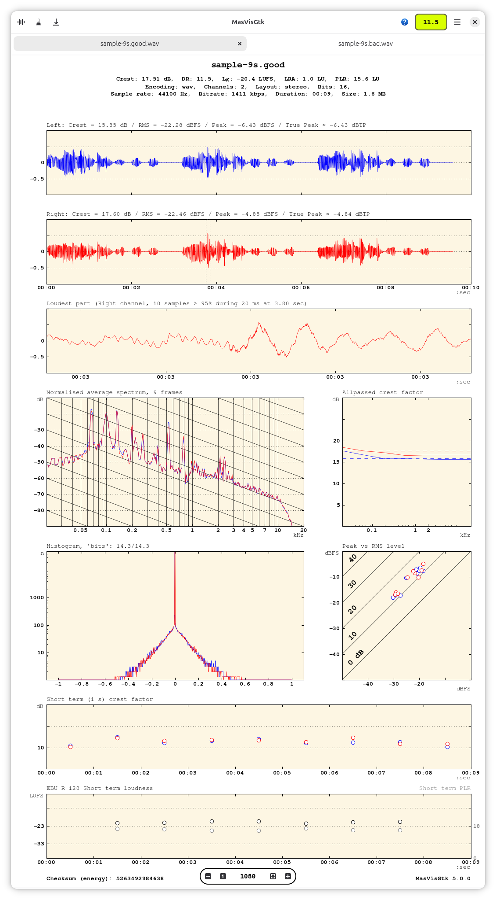
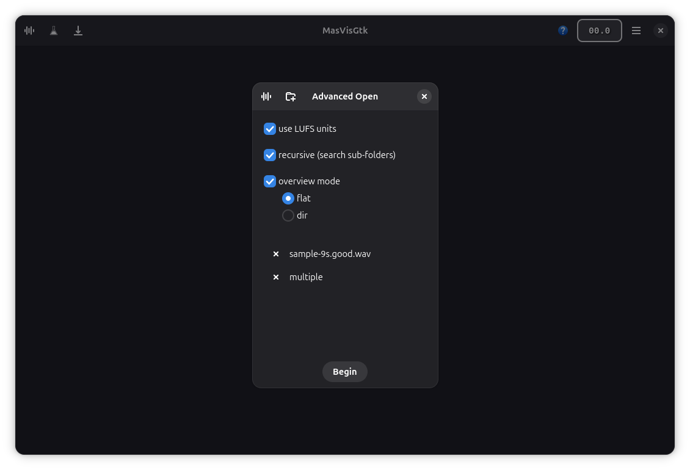
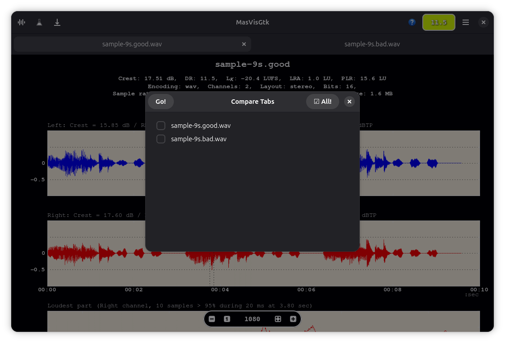

# MasVisGtk


Audio **loudness analysis** tool for your **music library**, made for the GNOME desktop

---

## 🎵 What is MasVisGtk?

**MasVisGtk** is a powerful and comprehensive audio analysis tool specifically designed for music enthusiasts, audio engineers, and anyone who wants to understand and improve their music library quality. Built for the GNOME desktop environment, this application helps you identify audio mastering problems and provides detailed technical insights about your audio files.

**Why Use MasVisGtk?**

- **Detect Mastering Issues:** Identify over-compressed, "brick-walled" audio files
- **Improve Library Quality:** Make informed decisions about audio file quality
- **Professional Analysis:** Get broadcast-standard measurements (EBU R128)
- **Visual Understanding:** See your audio through professional waveforms and frequency plots
- **Batch Processing:** Analyse entire music collections efficiently

**Simple Workflow:**

1. **Open** your audio file(s) or folder(s)
2. **Analyse**, viewing detailed technical measurements and visual plots
3. **Save** results in multiple professional formats (optional)

Based on the proven `pymasvis` Python module, MasVisGtk uses standard libraries (`numpy`, `scipy`, `matplotlib`) to provide accurate audio analysis.

---

## ✨ Comprehensive Features

### 📊 **Professional Audio Analysis**
- **🌊 Waveform Plotting** - Visual representation of your audio signal over time, showing amplitude variations and helping identify clipping or distortion
- **📈 Frequency Analysis** - Detailed frequency spectrum plots revealing the tonal balance and frequency distribution of your audio
- **📏 Dynamic Range (DR) Estimation** - Measures the difference between the loudest and quietest parts, indicating how compressed your audio is
- **⚡ Peak Estimation** - Identifies the highest signal levels to detect potential clipping and distortion
- **📊 Crest Factor Analysis** - Ratio between peak and RMS levels, indicating audio dynamics and compression level
- **📈 Histogram Visualisation** - Statistical distribution of audio levels showing how your audio energy is distributed
- **📊 Peak vs RMS Analysis** - Relationship plots between instantaneous peaks and average loudness levels  
- **🎚️ EBU R128 Loudness Standards** - Professional broadcast loudness measurements (LUFS/LU) used by streaming services and broadcasters
- **🔊 Multi-channel Audio Support** - Analyse stereo, surround sound, and other multi-channel audio formats

### 🗂️ **Efficient File Management**
- **📁 Folder Overview** - Batch analysis with organised folder-based results for managing large music libraries
- **🔄 Recursive Processing** - Automatically analyse entire directory trees including all subfolders
- **📊 Multiple View Modes** - Choose between flat view (all files together) or directory-based organisation
- **⚡ Parallel Processing** - Efficient handling of multiple files with optimised resource usage

### 🔌 **Use as a Plugin in a DAW**
- There is a [Windows VST3 plugin](https://github.com/itprojects/MasVisGtk/blob/plugin/MasVisGtkPlugin.vst3) version of MasVisGtk, for quick analysis [see plugin brach](https://github.com/itprojects/MasVisGtk/blob/plugin/README.md).

---

## 🎧 Supported Audio Formats

| Format | Extension | Description |
|--------|-----------|-------------|
| **WAV** | `.wav` | Uncompressed audio |
| **FLAC** | `.flac` | Lossless compression |
| **MP3** | `.mp3` | MPEG audio |
| **M4A** | `.m4a` | Apple audio |
| **OGG** | `.ogg` | Ogg Vorbis |
| **Opus** | `.opus` | Modern codec |
| **AAC** | `.aac` | Advanced audio coding |
| **AC3** | `.ac3` | Dolby Digital |
| **AIFF** | `.aiff` | Apple audio format |
| **AMR** | `.amr` | Adaptive multi-rate |
| **ALAC** | `.alac` | Apple lossless |
| **PCM** | `.pcm` | Raw audio data |
| **WMA** | `.wma` | Windows media audio |

---

## 💾 Professional Export Formats

Save your detailed analysis results in multiple industry-standard formats for documentation, reporting, or sharing:

```
📊 PNG  - Portable Network Graphics (best for web sharing and documentation)
📄 EPS  - Encapsulated PostScript (professional printing and vector graphics)  
🖼️ JPEG - Joint Photographic Experts Group (smaller file size, good for presentations)
📋 PDF  - Portable Document Format (universal document sharing and archiving)
🎨 SVG  - Scalable Vector Graphics (perfect scaling for any size, web-friendly)
🖥️ TIFF - Tagged Image File Format (high quality, professional archiving)
🌐 WebP - Modern web format (excellent compression with high quality)
```

**Professional Uses:**

- **Documentation** - Create technical reports for clients or projects
- **Comparison** - Side-by-side analysis of different masters or versions
- **Quality Control** - Archive analysis results for reference
- **Education** - Teaching materials for audio engineering courses

---

## 🖥️ System Requirements

### **Minimum Specifications**
- **CPU:** 2 physical cores, 4 threads
- **RAM:** 8 GB minimum
- **Storage:** ~200 MB for Flatpak installation
- **Dependencies:** FFMPEG and FFPROBE (locally installed)

### **Recommended for Large Files**
- **RAM:** 16 GB or more for files ≥20 minutes
- **CPU:** Multi-core processor for faster processing

---

## 📦 Installation

### **Option 1: Flathub (Recommended)**
```bash
flatpak install flathub io.github.itprojects.MasVisGtk
```

### **Option 2: Build from Source**
1. **Clone the repository**
   ```bash
   git clone [repository-url]
   ```

2. **Open with GNOME Builder**
   - Import the project in GNOME Builder  
   - Build the project ⚠️ *First build takes significant time*

3. **Export Flatpak**
   - Use the Export option from the dropdown menu
   - Locate the built Flatpak at:
   ```
   ~/.var/app/org.gnome.Builder/cache/gnome-builder/projects/MasVisGtk/flatpak/staging/x86_64-main/io.github.itprojects.MasVisGtk.flatpak
   ```

4. **Install locally**
   ```bash
   flatpak install io.github.itprojects.MasVisGtk.flatpak
   ```

---

## 🚀 Usage

### **Launch Application**
```bash
# Start the GUI application
flatpak run io.github.itprojects.MasVisGtk
```

### **Command Line Options**

#### **Basic Usage**
```bash
# Open single file
flatpak run io.github.itprojects.MasVisGtk /path/to/audio.wav

# Open multiple files
flatpak run io.github.itprojects.MasVisGtk /path/to/file1.wav '/path/to/file 2.mp3'

# Open files and folders
flatpak run io.github.itprojects.MasVisGtk /path/to/file.mp3 '/path/to/music/folder'
```

#### **Advanced Options**
```bash
# Recursive folder processing
flatpak run io.github.itprojects.MasVisGtk -r /path/to/music/library

# Overview files and/or folders
flatpak run io.github.itprojects.MasVisGtk /path/to/file.mp3 '/path/to/folder where/other file.ogg'

# Recursive processing for overview (flat mode)
flatpak run io.github.itprojects.MasVisGtk -r -o flat /path/to/file.mp3 '/path/to/folder'

# Show help
flatpak run io.github.itprojects.MasVisGtk --help
```

#### **Command Line Flags**
| Flag | Description |
|------|-------------|
| `-v, --version` | Show version information |
| `-b, --verbose` | Enable verbose messages |
| `-d, --debug` | Enable debug messages |
| `-f, --formats` | Show supported FFMPEG formats |
| `-l, --LU` | Use LU instead of LUFS for R128 values |
| `-o, --overview-mode` | Set overview mode: `flat` or `dir` |
| `-r, --recursive` | Process subfolders recursively |

#### **Complete Help Output**
```
flatpak run io.github.itprojects.MasVisGtk --help
Usage:
  masvisgtk [OPTION…] FILES/FOLDERS
  FILE(S) and/or FOLDER(S) paths to process inside the application
  MasVisGtk is an audio file analysis application.
Help Options:
  -h, --help                 Show help options
  --help-all                 Show all help options
  --help-gapplication        Show GApplication options
Application Options:
  -v, --version              Version of MasVisGtk.
  -b, --verbose              Show Verbose Messages.
  -d, --debug                Show Debug Messages.
  -f, --formats              Show Supported [FFMPEG] Formats.
  -l, --LU                   Use [LU], instead of [LUFS], when displaying R128 values, (default: LUFS).
  -o, --overview-mode        flat, generate one overview tab for all, or dir, for one tab for folders, (default: flat).
  -r, --recursive            If input is a folder, process subfolders, too.
The original python module is also available with this package.
The command line options are different from the original.
Large file are always slow to render.
```

---

## 🔬 Advanced Usage: PyMasVis Module

The original `pymasvis` Python module is bundled for command-line analysis:

### **Detailed Analysis**
```bash
# Single file analysis
flatpak run io.github.itprojects.MasVisGtk --pymasvis --destdir /output/path /path/to/audio.wav

# Batch folder analysis
flatpak run io.github.itprojects.MasVisGtk --pymasvis -r --destdir /output/path '/path/to/folder'
```

### **Overview Generation**
```bash
# File overview
flatpak run io.github.itprojects.MasVisGtk --pymasvis --overview --destdir /output/path /path/to/file.wav

# Folder overview (flat mode)
flatpak run io.github.itprojects.MasVisGtk --pymasvis --overview --overview-mode flat --destdir /output/path '/path/to/folder'
```

### **PyMasVis Help**
```bash
flatpak run io.github.itprojects.MasVisGtk --pymasvis
usage: masvisgtk [-h] [--version] [-v] [-d] [-u username] [-p password] [-r] [--destdir destdir] [--update {yes,no,outdated}] [--format {png,jpg}] [--overview] [--overview-mode {dir,flat}]
                 [--lu]
                 input [input ...]
```

---

## 📈 Understanding Dynamic Range - Audio Quality Guide

### **What is Dynamic Range (DR)?**
Dynamic Range measures the difference between the loudest and quietest parts of your audio. Higher DR values typically indicate better audio quality with more natural dynamics, while lower DR values suggest heavy compression that can make music sound "flat" or "lifeless".

### **Dynamic Range Quality Assessment**

| DR Value | Quality Rating | Audio Characteristics | Listening Experience |
|----------|----------------|----------------------|---------------------|
| **DR1-6** | 🔴 **Poor** | Heavily compressed, "brick-walled" | Fatiguing, lacks depth, sounds "squashed" |
| **DR7-10** | 🟡 **Fair** | Moderately compressed | Acceptable, but could be better |
| **DR11-14** | 🟢 **Good** | Well-balanced dynamics | Enjoyable, good balance of loudness and dynamics |
| **DR15+** | 🟢 **Excellent** | Natural, uncompressed dynamics | Spacious, natural, professional quality |

### **Why Does This Matter?**
- **🎵 Music Quality:** Higher DR typically means the music will sound more natural and less fatiguing
- **🎧 Listening Fatigue:** Over-compressed audio (low DR) can cause ear fatigue during long listening sessions
- **🔊 Loudness War:** Many modern releases are over-compressed to sound "louder" but sacrifice audio quality
- **💿 Remastering:** Use DR analysis to compare different versions/remasters of the same album

**💡 Pro Tip:** Use MasVisGtk to compare different versions of your favourite albums and choose the best-sounding masters for your collection!

---

## 🎨 Application Screenshots

### **Interface Themes**

*Light theme interface showing comprehensive audio analysis with waveform, frequency plots, and detailed metrics*


*Dark theme providing the same detailed analysis in a modern, eye-friendly interface*


*Extended view of dark theme showing additional analysis panels and data visualisation*

### **Configuration & Settings**

*Advanced configuration panel allowing fine-tuning of analysis parameters and export settings*


*Application preferences window for customising default behaviour, file handling, and display options*

### **Batch Analysis & Overview**

*Overview mode displaying batch analysis results for multiple audio files with comparative metrics*

### **Comparison Features**

*Comparison dialogue interface for setting up side-by-side audio file analysis*


*Comparison window showing multiple audio files analysed simultaneously for direct comparison*

### **Export Results**

*Example of exported analysis results showing detailed waveform and frequency analysis*


*Additional export example demonstrating comprehensive audio metrics and visual representations*


*Animated demonstration of the comparison feature workflow and real-time analysis updates*

### **Dynamic Range Reference Chart**


*Professional Dynamic Range quality reference chart for interpreting DR values and audio quality assessment*

> **Chart Source:** The dynamic range chart is taken from a [post](forums.stevehoffman.tv) in a public forum.

---

## ⚠️ Known Issues & Important Limitations

### **System Compatibility**
- **UTF-8 Systems Only:** The application is designed specifically for UTF-8 systems
- **Minimum Audio Duration:** Files must be at least **3 seconds long** - shorter samples will cause crashes
- **Dynamic Range Display:** `DR: ??` indicates the application has too few samples for accurate dynamic range estimation

### **Export & File Format Limitations**
- **Special Export Formats:** PostScript, PGF code for LaTeX, and Raw RGBA bitmap (Adobe Photoshop Color swatch) exports are only available through the in-app matplotlib toolbar
- **Video File Support:** Opening video files or unsupported formats is experimental - enable the testing option in preferences to try

### **Critical Performance Limitations**
⚠️ **The application is very RAM-intensive. Please follow these guidelines:**

**For Systems with 8GB RAM:**

- **DO NOT** open more than **10 files simultaneously**
- **DO NOT** open files if other applications are already using significant RAM

**For Large Files (≥20 minutes OR ≥100MB each):**

- **Requires 16GB RAM minimum**
- Monitor your system memory usage
- Close other applications before processing large files

**General Performance Notes:**

- Large files are always slow to render
- First-time analysis of complex files takes longer
- Consider processing large collections in smaller batches

---

## 🌐 Useful Resources

### **External Tools & References**
- 🎵 **[Loudness War Database](https://dr.loudness-war.info/)** - Compare your music's loudness metrics
- 📚 **[EBU R128 Guidelines](https://tech.ebu.ch/publications/tech3343)** - Professional loudness standards
- 🔧 **[Original PyMasVis](https://github.com/joakimfors/PyMasVis)** - Source project by Joakim Fors
- 🎓 **[MasVis Collaboration](https://www.lts.a.se/ljudteknik/masvis)** - Academic research background

---

## 📋 Technical Details

### **Core Dependencies**
- **Python Libraries:** `numpy`, `scipy`, `matplotlib`
- **Audio Processing:** FFMPEG/FFPROBE
- **GUI Framework:** GTK for GNOME
- **Packaging:** Flatpak with bundled dependencies

### **Source Code**
- **Size:** <1 MB source code
- **Flatpak Size:** >200 MB (includes `openblas`, `lapack`, `numpy`, `scipy`, `pyplot`)

---

## 📄 License

**MasVisGtk** is released under the **GNU General Public License v2.0 or later**.

You are free to use, modify, and distribute this software under the terms of the GPL.
